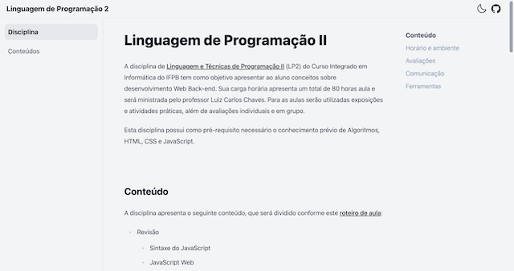

# Linguagem de Programação II

A disciplina de Linguagem e Técnicas de Programação II (LP2) do Curso Integrado em Informática do IFPB tem como objetivo apresentar ao aluno conceitos sobre desenvolvimento Web Back-end. Sua carga horária apresenta um total de 80 horas aula e será ministrada pelo professor Luiz Carlos Chaves. Para as aulas serão utilizadas exposições e atividades práticas, além de avaliações individuais e em grupo.

Esta disciplina possui como pré-requisito necessário o conhecimento prévio de Algoritmos, HTML, CSS e JavaScript.

## Comandos

| Command                | Action                                           |
| :--------------------- | :----------------------------------------------- |
| `npm install`          | Installs dependencies                            |
| `npm run dev`          | Starts local dev server at `localhost:3000/lp2`  |
| `npm run build`        | Build your production site to `./dist/`          |
| `npm run preview`      | Preview your build locally, before deploying     |
