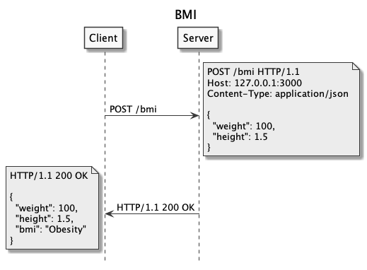

# Construção de Backend

- [Express](#express)
  - [Definição](#definição)
  - [Características](#características)
  - [Estrutura do projeto](#estrutura-do-projeto)
- [Rotas da Aplicação](#rotas-da-aplicação)
- [Parâmetros da Requisição](#parâmetros-da-requisição)
  - [Tipos de Parâmetros](#tipos-de-parâmetros)
  - [Query Param](#query-param)
  - [Route Param](#route-param)
  - [Body Param](#body-param)
  - [Resumo das Rotas](#resumo-das-rotas)
- [Referências](#referências)

## Express

---

### Definição

[http://expressjs.com/](http://expressjs.com/):

> Express is a minimal and flexible Node.js web application framework that provides a robust set of features for web and mobile applications.

### Características

- Rápido
- Minimalista
- Flexível
- Não opinativo
- Usado para montar APIs
- Alguns frameworks são baseados no Express

### Estrutura do projeto

```
hello-simple
├── .gitignore
├── package-lock.json
├── package.json
├── requests.http
└── src
    └── index.js
```


hello-simple/src/index.js:

```js

```

Criar o arquivo `package.json`:

```sh
$ npm init -y
```

Adicionar o Express como dependência do projeto e executar o servidor localmente:

```sh
$ npm install express
$ node src/index.js
$ npm start
```

Adicionar o nodemon como dependência de desenvolvimento e executar o servidor enquanto desenvolve:

```sh
$ npm install nodemon -D
$ npx nodemon src/index.js
$ npm run dev
```

hello-simple/package.json:

```json

```

> Cuidado no git para não versionar a pasta `node_modules/`, use o arquivo `.gitignore` para desconsiderar a pasta.

hello-simple/.gitignore:

```
node_modules/

```

hello-simple/requests.http:

```

```


[](https://codesandbox.io/s/express-hello-simple-w0gy4?fontsize=14&hidenavigation=1&theme=dark)

## Rotas da Aplicação

---

Rotas:

- `/hello/en` => `Hello World!`
- `/hello/pt` => `Olá Mundo!`


```
hello-lang
├── .gitignore
├── package-lock.json
├── package.json
├── requests.http
└── src
    └── index.js
```

hello-lang/src/index.js:

```js

```

hello-lang/package.json:

```json

```

hello-lang/requests.http:

```

```

[](https://codesandbox.io/s/express-hello-lang-wnqe3?fontsize=14&hidenavigation=1&theme=dark)

## Parâmetros da Requisição

---

### Tipos de Parâmetros


Parâmetros:

- Query Param
- Route Param
- Body Param

### Query Param


```
bmi-query-param
├── .gitignore
├── package-lock.json
├── package.json
├── requests.http
└── src
    ├── bmi.js
    └── index.js
```

bmi-query-param/src/bmi.js:

```js

```

bmi-query-param/src/index.js:

```js

```

bmi-query-param/package.json:

```json

```

bmi-query-param/requests.http:

```

```

[](https://codesandbox.io/s/express-bmi-query-param-2200f?fontsize=14&hidenavigation=1&theme=dark)

### Route Param


```
bmi-route-param
├── .gitignore
├── package-lock.json
├── package.json
├── requests.http
└── src
    ├── bmi.js
    └── index.js
```

bmi-route-param/src/index.js:

```js

```

bmi-route-param/requests.http:

```

```

[](https://codesandbox.io/s/express-bmi-route-param-stu6s?fontsize=14&hidenavigation=1&theme=dark)

### Body Param



```
bmi-body-param
├── .gitignore
├── package-lock.json
├── package.json
├── requests.http
└── src
    ├── bmi.js
    └── index.js
```

bmi-body-param/src/index.js:

```js

```

bmi-body-param/requests.http:

```

```

[](https://codesandbox.io/s/express-bmi-body-param-gh2hg?fontsize=14&hidenavigation=1&theme=dark)

[REQBIN](https://reqbin.com/wijfzyzb)

### Resumo das Rotas

| Tipo          | Acesso       | HTTP | Rota                                 | Dados                              |
| ------------- | ------------ | ---- | ------------------------------------ | ---------------------------------- |
| `Query Param` | `req.query`  | GET  | `/bmi?weight=x&height=y`             | `?weight=100&height=1.5`           |
| `Route Param` | `req.params` | GET  | `/bmi/weight/:weight/height/:height` | `/bmi/weight/100/height/1.5`       |
| `Body Param`  | `req.body`   | POST | `/bmi`                               | `{ "weight": 100, "height": 1.5 }` |

## Referências

---

- [Express](https://expressjs.com/)
  - [Guide](https://expressjs.com/en/guide/routing.html)
  - [API](https://expressjs.com/en/4x/api.html)
