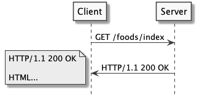
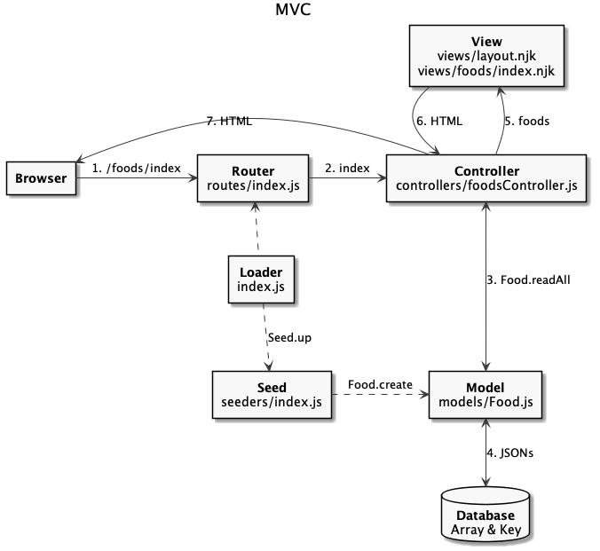
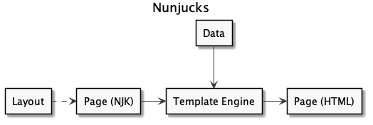
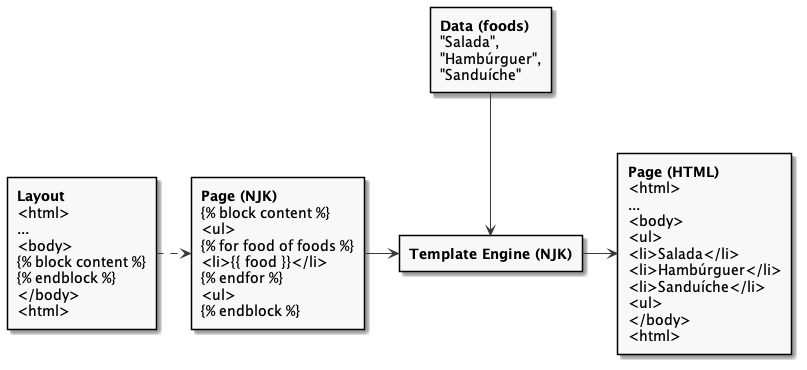

# Template Engine

  - [Conteúdo Estático e Dinâmico](#conteúdo-estático-e-dinâmico)
  - [Local da Renderização](#local-da-renderização)
  - [Arquitetura do MVC](#arquitetura-do-mvc)
  - [Aplicação com MVC](#aplicação-com-mvc)
    - [Estrutura de Código](#estrutura-de-código)
    - [Loader](#loader)
    - [Seed](#seed)
    - [Model](#model)
    - [Router](#router)
    - [Controller](#controller)
    - [View](#view)

## Conteúdo Estático e Dinâmico

---


## Local da Renderização

---

| Client Side Rendering (CSR) | Server Side Rendering (SSR) |
| --------------------------- | --------------------------- |
|          |          |

## Arquitetura do MVC

---

- Model View Controller (MVC)



## Aplicação com MVC

---

### Estrutura de Código

```
foods-app
├── .gitignore
├── package-lock.json
├── package.json
├── public
│   ├── css
│   │   └── bootstrap.min.css
│   ├── foods.html
│   ├── imgs
│   │   ├── hamburguer.jpg
│   │   ├── salada.jpg
│   │   └── sanduiche.jpg
│   └── js
│       ├── bootstrap.min.js
│       ├── jquery.min.js
│       └── popper.min.js
└── src
    ├── controllers
    │   └── foodsController.js
    ├── index.js
    ├── models
    │   └── Food.js
    ├── routes
    │   └── index.js
    ├── seeders
    │   └── index.js
    └── views
        ├── foods
        │   └── index.njk
        └── layout.njk
```

[](https://codesandbox.io/s/express-foods-app-simple-c7jpe?fontsize=14&hidenavigation=1&theme=dark)

### Loader

src/index.js:

```js

```

```bash
$ npm install express nunjucks
```

### Seed

src/seeders/index.js:

```js

```

### Model

src/models/Food.js:

```js

```

### Router

src/routes/index.js:

```js

```

### Controller

src/controllers/foodsController.js:

```js

```

### View





src/views/foods/index.njk ([VScode Nunjucks](https://marketplace.visualstudio.com/items?itemName=ronnidc.nunjucks)):

```html






<h1 class="my-5 text-center">{{ title }}</h1>

<section class="card-deck">
  
  <div class="card">
    <div class="card-header text-center font-weight-bold">
      {{ food.name }}
    </div>
    <div class="card-body p-0">
      
    </div>
    <div class="card-footer text-right">
      {{ food.price }}
    </div>
  </div>
  
</section>



<script>
  const prices = document.querySelectorAll('.card-footer');
  prices.forEach((price) => {
    price.innerHTML = Intl.NumberFormat('pt-BR', {
      style: 'currency',
      currency: 'BRL',
    }).format(price.innerHTML);
  });
</script>
 
```

src/views/layout.njk:

```html

<!DOCTYPE html>
<html lang="en">
<head>
  <meta charset="utf-8">
  <meta name="viewport" content="width=device-width, initial-scale=1, shrink-to-fit=no">
  <link rel="stylesheet" href="/css/bootstrap.min.css">
  <title>{{ title }}</title>
</head>
<body>
  <div class="container">
    
    
  <div>
  <script src="/js/jquery.min.js"></script>
  <script src="/js/popper.min.js"></script>
  <script src="/js/bootstrap.min.js"></script>
  
  
</body>
</html>

```


