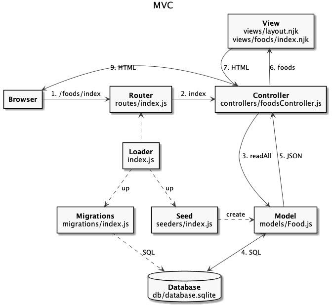
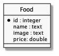

# Banco de Dados

  - [MVC com Banco de Dados](#mvc-com-banco-de-dados)
  - [Aplicação com SQLite](#aplicação-com-sqlite)
    - [Estrutura de Código](#estrutura-de-código)
    - [Loader](#loader)
    - [Migration](#migration)
    - [Database](#database)
    - [Model](#model)
    - [Controller](#controller)

## MVC com Banco de Dados

---



## Aplicação com SQLite

---

### Estrutura de Código

```
foods-app
├── .gitignore
├── package-lock.json
├── package.json
├── public
│   ├── css
│   │   └── bootstrap.min.css
│   ├── foods.html
│   ├── imgs
│   │   ├── hamburguer.jpg
│   │   ├── salada.jpg
│   │   └── sanduiche.jpg
│   └── js
│       ├── bootstrap.min.js
│       ├── jquery.min.js
│       └── popper.min.js
└── src
    ├── controllers
    │   └── foodsController.js
    ├── db
    │   ├── database.sqlite
    │   └── index.js
    ├── index.js
    ├── migrations
    │   └── index.js
    ├── models
    │   └── Food.js
    ├── routes
    │   └── index.js
    ├── seeders
    │   └── index.js
    └── views
        ├── foods
        │   └── index.njk
        └── layout.njk
```

[](https://codesandbox.io/s/express-foods-app-sqlite-simple-y472j?fontsize=14&hidenavigation=1&theme=dark)

### Loader

src/index.js:

```js

```

```bash
$ npm install express nunjucks
```

### Migration

[vscode-sqlite](https://marketplace.visualstudio.com/items?itemName=alexcvzz.vscode-sqlite):



src/migrations/index.js:

```js

```

### Database


src/db/index.js:

```js

```

```bash
$ npm install sqlite-async
```

### Model

src/models/Food.js:

```js

```

### Controller

src/controllers/foodsController.js:

```js

```
