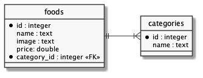

# Relacionamento no Banco de Dados

  - [Arquitetura da Aplicação](#arquitetura-da-aplicação)
  - [Entidades do Banco](#entidades-do-banco)
  - [Estrutura de Código](#estrutura-de-código)
  - [Migration](#migration)
  - [Seeders](#seeders)
  - [Model](#model)
  - [View](#view)

## Arquitetura da Aplicação

---


## Entidades do Banco

---



## Estrutura de Código

---

```
foods-app
├── .gitignore
├── package-lock.json
├── package.json
├── public
│   ├── css
│   │   └── bootstrap.min.css
│   ├── foods.html
│   ├── imgs
│   │   ├── hamburguer.jpg
│   │   ├── milkshake.jpg
│   │   ├── sanduiche.jpg
│   │   └── suco.jpg
│   └── js
│       ├── bootstrap.min.js
│       ├── jquery.min.js
│       └── popper.min.js
└── src
    ├── controllers
    │   └── foodsController.js
    ├── db
    │   ├── database.sqlite
    │   └── index.js
    ├── index.js
    ├── migrations
    │   └── index.js
    ├── models
    │   ├── Category.js
    │   └── Food.js
    ├── routes
    │   └── index.js
    ├── seeders
    │   ├── data.json
    │   └── index.js
    └── views
        ├── foods
        │   └── index.njk
        └── layout.njk
```

[](https://codesandbox.io/s/express-foods-app-sqlite-has-many-2c981?fontsize=14&hidenavigation=1&theme=dark)

## Migration

---


src/migrations/index.js:

```js

```

## Seeders

---

src/seeders/data.json:

```json

```

src/seeders/index.js:

```js

```

## Model

---

src/models/Food.js:

```js

```

src/models/Category.js:

```js

```

## View

---

src/views/foods/index.njk:

```html






<h1 class="my-5 text-center">{{ title }}</h1>

<section class="card-deck">
  
  <div class="col-sm-6 col-lg-4 col-xl-3 mb-3">
    <div class="card">
      <div class="card-header text-center font-weight-bold">
        {{ food.name }}
      </div>
      <div class="card-body p-0">
        
      </div>
      <div class="card-footer text-right">
        <span class="food-category float-left badge badge-secondary">{{ food.category }}</span>
        <span class="food-price">{{ food.price }}</span>
      </div>
    </div>
  </div>
  
</section>



<script>
  const prices = document.querySelectorAll('.card-footer .food-price');
  prices.forEach((price) => {
    price.innerHTML = Intl.NumberFormat('pt-BR', {
      style: 'currency',
      currency: 'BRL',
    }).format(price.innerHTML)
  });
</script>


```


