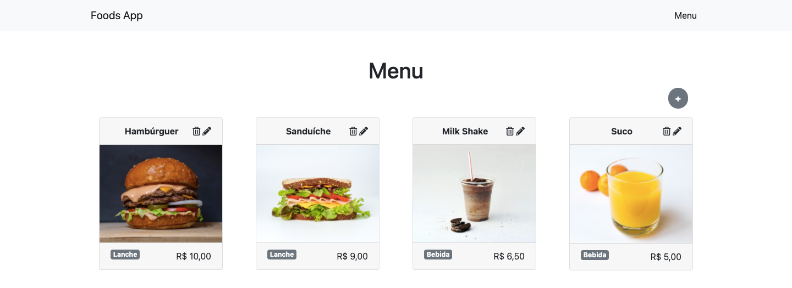
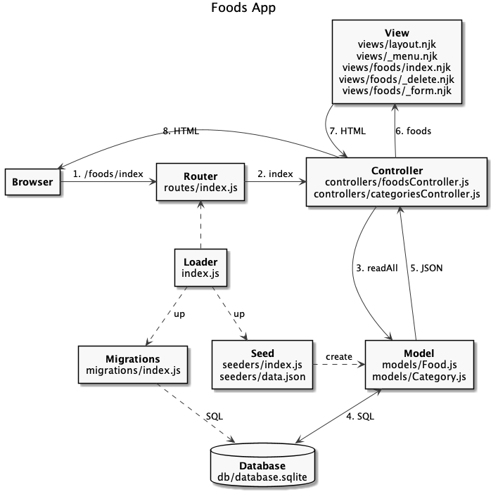
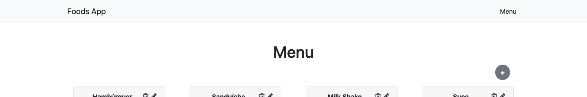

# Revisão

  - [Foods App](#foods-app)
  - [Arquitetura do Código](#arquitetura-do-código)
  - [Menu](#menu)
  - [HTTP 404 e 500](#http-404-e-500)
  - [NPM Scripts](#npm-scripts)

## Foods App

---



## Arquitetura do Código

---




```
foods-app-crud
├── .gitignore
├── package-lock.json
├── package.json
├── public
│   ├── css
│   │   ├── bootstrap.min.css.map
│   │   └── bootstrap.min.css
│   ├── foods.html
│   ├── imgs
│   │   ├── batatafrita.jpg
│   │   ├── hamburguer.jpg
│   │   ├── milkshake.jpg
│   │   ├── sanduiche.jpg
│   │   └── suco.jpg
│   └── js
│       ├── bootstrap.min.js
│       ├── bootstrap.min.js.map
│       ├── jquery.min.js
│       ├── popper.min.js
│       ├── popper.min.js.map
│       └── services
│           └── api.js
├── requests.http
└── src
    ├── controllers
    │   ├── categoriesController.js
    │   └── foodsController.js
    ├── db
    │   ├── database.sqlite
    │   ├── index.js
    │   ├── migration.js
    │   └── seed.js
    ├── index.js
    ├── migrations
    │   └── index.js
    ├── models
    │   ├── Category.js
    │   └── Food.js
    ├── routes
    │   └── index.js
    ├── seeders
    │   ├── data.json
    │   └── index.js
    └── views
        ├── foods
        │   ├── _delete.njk
        │   ├── _form.njk
        │   └── index.njk
        ├── _menu.njk
        └── layout.njk
```

[](https://codesandbox.io/s/sharp-mcnulty-766nc?fontsize=14&hidenavigation=1&theme=dark)

## Menu

---



src/views/_menu.njk ([Navbar Bootstrap](https://getbootstrap.com/docs/5.0/components/navbar/)):

```html

```

src/views/layout.njk:

```html

<body>
  
  <div class="container">
    
    
  <div>
  ...
</body>

```

## HTTP 404 e 500

---

src/index.njk:
```js
...

app.use((req, res, next) => {
  res.status(404).send('Content not found');
});

app.use((err, req, res, next) => {
  console.error(err.stack);
  res.status(500).send('Internal server error');
});

app.listen(3000, () => {
  console.log('Food App is running!');
});
```

## NPM Scripts

---

```js
{
  ...
  scripts": {
    "start": "node src/index.js",
    "dev": "nodemon src/index.js",
    "db:reload": "npm run db:drop && npm run db:load",
    "db:load": "npm run db:migration && npm run db:seed",
    "db:migration": "node src/db/migration.js",
    "db:seed": "node src/db/seed.js",
    "db:drop": "[ -f src/db/database.sqlite ] && rm src/db/database.sqlite"
  },
  ...
}
```

```
$ npm start
$ npm run dev
$ npm run db:reload
$ npm run db:load
$ npm run db:migration
$ npm run db:seed
$ npm run db:drop
```
