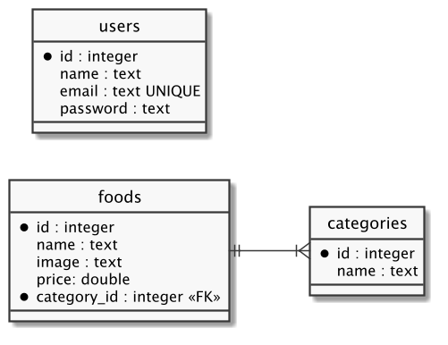

# Cadastro de Usuário

  - [Foods App](#foods-app)
  - [Arquitetura do Código](#arquitetura-do-código)
  - [Load](#load)
  - [Model](#model)
  - [Controller](#controller)
  - [View](#view)

## Foods App

---


## Arquitetura do Código

---


```
foods-app-user
├── .gitignore
├── package-lock.json
├── package.json
├── public
│   ├── css
│   │   ├── bootstrap.min.css
│   │   └── bootstrap.min.css.map
│   ├── foods.html
│   ├── imgs
│   │   ├── batatafrita.jpg
│   │   ├── hamburguer.jpg
│   │   ├── milkshake.jpg
│   │   ├── sanduiche.jpg
│   │   └── suco.jpg
│   └── js
│       ├── bootstrap.min.js
│       ├── bootstrap.min.js.map
│       ├── jquery.min.js
│       ├── popper.min.js
│       ├── popper.min.js.map
│       └── services
│           └── api.js
├── requests.http
└── src
    ├── controllers
    │   ├── categoriesController.js
    │   ├── foodsController.js
    │   └── usersController.js
    ├── db
    │   ├── database.sqlite
    │   ├── index.js
    │   ├── migration.js
    │   └── seed.js
    ├── index.js
    ├── migrations
    │   └── index.js
    ├── models
    │   ├── Category.js
    │   ├── Food.js
    │   └── User.js
    ├── routes
    │   └── index.js
    ├── seeders
    │   ├── data.json
    │   └── index.js
    └── views
        ├── _menu.njk
        ├── foods
        │   ├── _delete.njk
        │   ├── _form.njk
        │   └── index.njk
        ├── layout.njk
        └── users
            ├── _form.njk
            └── create.njk
```

[](https://codesandbox.io/s/interesting-agnesi-4o44h?fontsize=14&hidenavigation=1&theme=dark)

## Load

---

src/ìndex.js:

```js
...
const app = express();

app.use(express.json());
app.use(express.urlencoded({ extended: true }));

app.use(express.static('public'));
...
```

## Model

---



src/migrations/index.js:

```js
const { conn } = require('../db');

async function up() {
  ...

  await db.run(`
    CREATE TABLE IF NOT EXISTS users (
      id INTEGER PRIMARY KEY AUTOINCREMENT,
      name TEXT,
      email TEXT UNIQUE,
      password TEXT
    )
  `);
}

async function down() {
  const db = await conn();

  await db.run('DROP TABLE users');

  ...
}

module.exports = { up, down };
```

src/seeders/index.js:
```js
const Food = require('../models/Food');
const Category = require('../models/Category');
const User = require('../models/User');
const fs = require('fs');
const path = require('path');

function up() {
  const content = fs.readFileSync(path.join(__dirname, 'data.json'));
  const data = JSON.parse(content);

  ...

  for (const user of data.users) {
    User.create(user);
  }
}

module.exports = { up };
```

src/seeders/data.json:
```json
{
  "foods": [
    ...
  ],
  "categories": [
    ...
  ],
  "users": [
    {
      "id": 1,
      "name": "admin",
      "email": "admin@email.com",
      "password": "admin"
    }
  ]
}
```

src/models/User.js:

```js

```

```
$ npm install bcrypt
$ npm run db:reload
```

## Controller

---

src/routes/index.js:

```js

```

src/controllers/usersController.js:

```js

```

## View

---

src/views/users/create.njk:

```html






<h1 class="mt-5 text-center">
  {{ title }}
</h1>

<div class="row">
  <div class="col-md-6 mx-auto mb-5">
    <form id="formUser" action="/signup" method="post">
      <div class="form-group">
        <label for="user-name">Nome</label>
        <input type="text" class="form-control" id="user-name" name="name">
      </div>
      <div class="form-group">
        <label for="user-email">E-mail</label>
        <input type="email" class="form-control" id="user-email" name="email">
      </div>
      <div class="form-group">
        <label for="user-password">Senha</label>
        <input type="password" class="form-control" id="user-password" name="password">
      </div>
      <div class="form-group">
        <label for="user-confirm_password">Confirmar Senha</label>
        <input type="password" class="form-control" id="user-confirm_password" name="confirm_password">
      </div>
      <div class="form-group">
        <button type="submit" class="btn btn-primary float-right">Confirmar</button>
      </div>
    </form>
  </div>
</div>


```

src/views/_menu.njk:

```html

<ul class="navbar-nav ml-auto">
  <li class="nav-item active">
    <a class="nav-link" href="/">Menu </a>
  </li>
  <li class="nav-item active">
    <a class="nav-link" href="/signup">Cadastrar</a>
  </li>
</ul>

```
