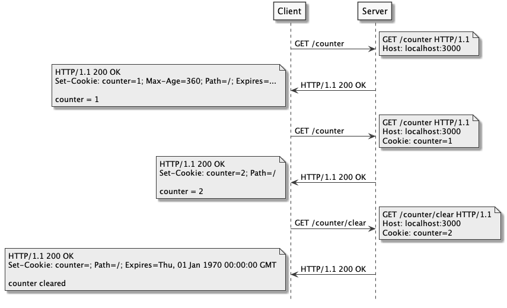
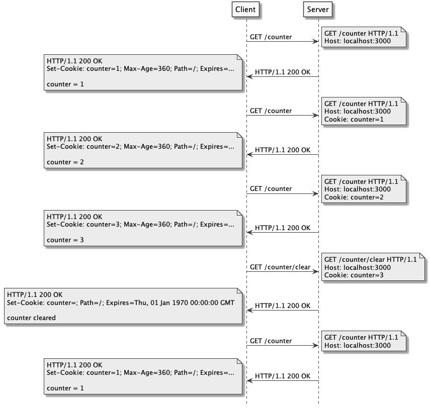
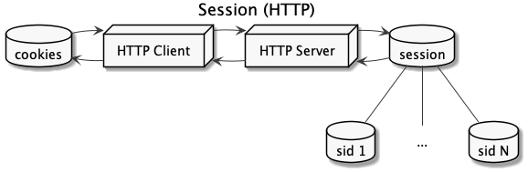
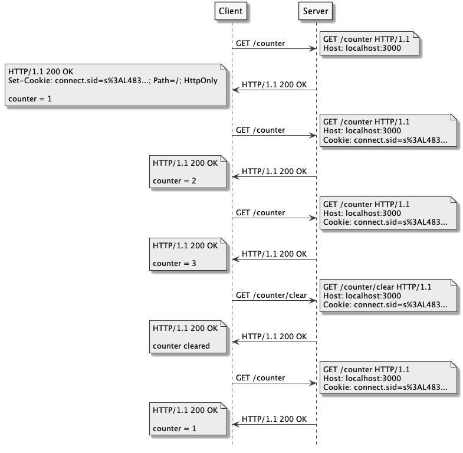
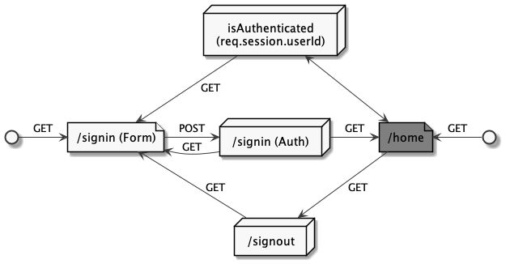

# Manipulação de Sessão

- [Manipulação de Sessão](#manipulação-de-sessão)
  - [Cookie](#cookie)
    - [Front-end (window.document.cookie)](#front-end-windowdocumentcookie)
    - [Back-end (express, cookie-parser)](#back-end-express-cookie-parser)
    - [Exemplo (Contador)](#exemplo-contador)
  - [Session](#session)
    - [Back-end (express-session)](#back-end-express-session)
    - [Exemplo (Contador)](#exemplo-contador-1)
  - [Autenticação](#autenticação)
  - [Referências](#referências)

## Cookie

---


Propósito:
- Gerenciamento de sessão
- Personalização
- Rastreamento

> Alternativas: Web Storage API e IndexedDB

### Front-end (window.document.cookie)

| Ações  | Código                                                                 |
| ------ | ---------------------------------------------------------------------- |
| Create | `document.cookie = 'counter = 1'`                                      |
| Read   | `document.cookie`                                                      |
| Update | `document.cookie = 'counter = 2'`                                      |
| Delete | `document.cookie = 'counter =; Expires=Thu, 01 Jan 1970 00:00:00 GMT'` |

[RFC 6265 - HTTP State Management Mechanism](https://tools.ietf.org/html/rfc6265):

| Propriedade | Tipo              |
| ----------- | ----------------- |
| domain      | String            |
| expires     | Date              |
| httpOnly    | Boolean           |
| maxAge      | Number            |
| path        | String            |
| secure      | Boolean           |

[Chrome DevTools (View, Edit, And Delete Cookies With Chrome DevTools)](https://developers.google.com/web/tools/chrome-devtools/storage/cookies)

### Back-end (express, cookie-parser)

| Ações  | Código                                       | Referência                                                                               |
| ------ | -------------------------------------------- | ---------------------------------------------------------------------------------------- |
| Create | `res.cookie('counter', 1, {maxAge: 360000})` | [res.cookie(name, value [, options])](http://expressjs.com/en/5x/api.html#res.cookie)    |
| Read   | `req.cookies.counter`                        | [cookie-parser](https://github.com/expressjs/cookie-parser)                              |
| Update | `res.cookie('counter', 2)`                   | [res.cookie(name, value [, options])](http://expressjs.com/en/5x/api.html#res.cookie)    |
| Delete | `res.clearCookie('counter')`                 | [res.clearCookie(name [, options])](http://expressjs.com/en/5x/api.html#res.clearCookie) |

RFC 6265 - HTTP Request (Cookie), HTTP Response (Set-Cookie):



### Exemplo (Contador)

src/index.js:

```js

```

[](https://codesandbox.io/s/heuristic-morning-0rksr?fontsize=14&hidenavigation=1&theme=dark)



## Session

---



[Session Storage (express-session)](https://github.com/expressjs/session#compatible-session-stores):

- MemoryStore (default)
- [connect-redis](https://github.com/tj/connect-redis#readme)
- [connect-mongo](https://github.com/jdesboeufs/connect-mongo#readme)
- [connect-sqlite3](https://github.com/rawberg/connect-sqlite3#readme)

### Back-end (express-session)

[req.session (express-session)](https://github.com/expressjs/session#readme):

| Ações  | Código                       |
| ------ | ---------------------------- |
| Create | `req.session.counter = 1`    |
| Read   | `req.session.counter`        |
| Update | `req.session.counter = 2`    |
| Delete | `delete req.session.counter` |

### Exemplo (Contador)

src/index.js:

```js

```

[](https://codesandbox.io/s/festive-heyrovsky-ymk52?fontsize=14&hidenavigation=1&theme=dark)



## Autenticação

---

[Fluxo](assets/auth-request.png):



```
auth
├── package-lock.json
├── package.json
└── src
    ├── controllers
    │   └── SessionController.js
    ├── index.js
    ├── middleware
    │   └── auth.js
    ├── routes
    │   └── index.js
    └── views
        ├── home.njk
        └── signin.njk
```

src/index.js:

```js

```

src/routes/index.js:

```js

```

src/middleware/auth.js:

```js

```

src/controllers/SessionController.js:

```js

```

[](https://codesandbox.io/s/nice-poincare-jn9fm?fontsize=14&hidenavigation=1&theme=dark)

## Referências

---

- [Using HTTP cookies](https://developer.mozilla.org/en-US/docs/Web/HTTP/Cookies)
- [Use cookies securely](https://expressjs.com/en/advanced/best-practice-security.html#use-cookies-securely)
- Pacotes:
  - [cookie-parser](https://github.com/expressjs/cookie-parser#readme)
  - [express-session](https://github.com/expressjs/session#readme)
  - [cookie-session](http://expressjs.com/en/resources/middleware/cookie-session.html)
  - [connect-sqlite3](https://github.com/rawberg/connect-sqlite3#readme)
  - [bcrypt](https://github.com/kelektiv/node.bcrypt.js#readme)
