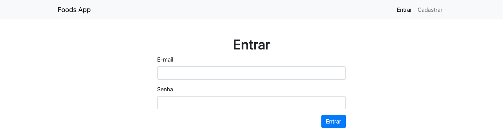

# Autenticação

  - [Foods App](#foods-app)
  - [Arquitetura do Código](#arquitetura-do-código)
  - [Load](#load)
  - [Controller](#controller)
  - [View](#view)

## Foods App

---



## Arquitetura do Código

---


```
foods-app-auth
├── .gitignore
├── package-lock.json
├── package.json
├── public
│   ├── css
│   │   ├── bootstrap.min.css
│   │   └── bootstrap.min.css.map
│   ├── foods.html
│   ├── imgs
│   │   ├── batatafrita.jpg
│   │   ├── hamburguer.jpg
│   │   ├── milkshake.jpg
│   │   ├── sanduiche.jpg
│   │   └── suco.jpg
│   └── js
│       ├── bootstrap.min.js
│       ├── bootstrap.min.js.map
│       ├── jquery.min.js
│       ├── popper.min.js
│       ├── popper.min.js.map
│       └── services
│           └── api.js
├── requests.http
└── src
    ├── controllers
    │   ├── authController.js
    │   ├── categoriesController.js
    │   ├── foodsController.js
    │   └── usersController.js
    ├── db
    │   ├── database.sqlite
    │   ├── index.js
    │   ├── migration.js
    │   └── seed.js
    ├── index.js
    ├── middleware
    │   └── auth.js
    ├── migrations
    │   └── index.js
    ├── models
    │   ├── Category.js
    │   ├── Food.js
    │   └── User.js
    ├── routes
    │   └── index.js
    ├── seeders
    │   ├── data.json
    │   └── index.js
    └── views
        ├── _menu.njk
        ├── auth
        │   └── create.njk
        ├── foods
        │   ├── _delete.njk
        │   ├── _form.njk
        │   └── index.njk
        ├── layout.njk
        └── users
            └── create.njk
```

[](https://codesandbox.io/s/stoic-ritchie-2d70r?fontsize=14&hidenavigation=1&theme=dark)

## Load

---

src/ìndex.js:

```js
const fs = require('fs');
const express = require('express');
const nunjucks = require('nunjucks');
const cookieParser = require('cookie-parser');
const session = require('express-session');
const SQLiteStore = require('connect-sqlite3')(session);
const routes = require('./routes');
const Seed = require('./seeders');
const Migration = require('./migrations');
const { dbFile } = require('./db');
const Auth = require('./middleware/auth');

...

const app = express();

app.use(express.json());
app.use(express.urlencoded({ extended: true }));

app.use(cookieParser());
app.use(
  session({
    store: new SQLiteStore(),
    secret: 'secret',
    resave: false,
    saveUninitialized: true,
  })
);
app.use(Auth.activeLocalSession);
...
```

```
$ npm i cookie-parser express-session connect-sqlite3
```

## Controller

---

src/routes/index.js:

```js

```

src/controllers/authController.js:

```js

```

src/middleware/auth.js:

```js

```

## View

---

src/views/_menu.njk:

```html

<nav class="navbar navbar-expand-lg navbar-light bg-light">
  <div class="container">
    <a class="navbar-brand" href="/">Foods App</a>
    <button class="navbar-toggler" type="button" data-toggle="collapse" data-target="#navbarSupportedContent" aria-controls="navbarSupportedContent" aria-expanded="false" aria-label="Toggle navigation">
      <span class="navbar-toggler-icon"></span>
    </button>

    <div class="collapse navbar-collapse" id="navbarSupportedContent">
      <ul class="navbar-nav ml-auto">
        
        <li class="nav-item active">
          <a class="nav-link" href="/">Menu </a>
        </li>
        <li class="nav-item">
          <a class="nav-link" href="/signout">Sair</a>
        </li>
        
        <li class="nav-item active">
          <a class="nav-link" href="/signin">Entrar</a>
        </li>
        <li class="nav-item active">
          <a class="nav-link" href="/signup">Cadastrar</a>
        </li>
        
      </ul>
    </div>
  </div>
</nav>

```

src/views/auth/create.njk:

```html






<h1 class="mt-5 text-center">
  {{ title }}
</h1>

<div class="row">
  <div class="col-md-6 mx-auto">
    <form id="formUser" action="/signin" method="post">
      <div class="form-group">
        <label for="user-email">E-mail</label>
        <input type="email" class="form-control" id="user-email" name="email" required>
      </div>
      <div class="form-group">
        <label for="user-password">Senha</label>
        <input type="password" class="form-control" id="user-password" name="password" required>
      </div>
      <div class="form-group">
        <button type="submit" class="btn btn-primary float-right">Entrar</button>
      </div>
    </form>
  </div>
</div>



```
