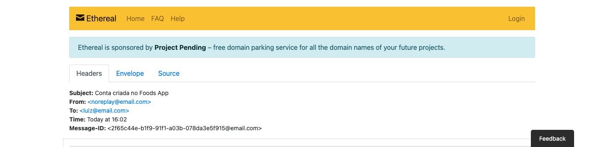
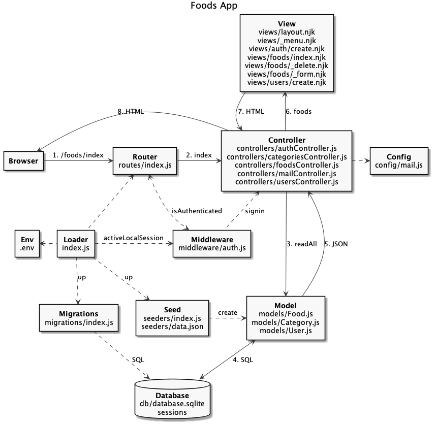

# Manipulação de Email

  - [Foods App](#foods-app)
  - [Arquitetura do Código](#arquitetura-do-código)
  - [Load](#load)
  - [Controller](#controller)

## Foods App

---



## Arquitetura do Código

---




```
foods-app-email
├── .env
├── .env.example
├── .gitignore
├── package-lock.json
├── package.json
├── public
│   ├── css
│   │   ├── bootstrap.min.css
│   │   └── bootstrap.min.css.map
│   ├── foods.html
│   ├── imgs
│   │   ├── batatafrita.jpg
│   │   ├── hamburguer.jpg
│   │   ├── milkshake.jpg
│   │   ├── sanduiche.jpg
│   │   └── suco.jpg
│   └── js
│       ├── bootstrap.min.js
│       ├── bootstrap.min.js.map
│       ├── jquery.min.js
│       ├── popper.min.js
│       ├── popper.min.js.map
│       └── services
│           └── api.js
├── requests.http
├── sessions
└── src
    ├── config
    │   └── mail.js
    ├── controllers
    │   ├── authController.js
    │   ├── categoriesController.js
    │   ├── foodsController.js
    │   ├── mailController.js
    │   └── usersController.js
    ├── db
    │   ├── database.sqlite
    │   ├── index.js
    │   ├── migration.js
    │   └── seed.js
    ├── index.js
    ├── middleware
    │   └── auth.js
    ├── migrations
    │   └── index.js
    ├── models
    │   ├── Category.js
    │   ├── Food.js
    │   └── User.js
    ├── routes
    │   └── index.js
    ├── seeders
    │   ├── data.json
    │   └── index.js
    └── views
        ├── _menu.njk
        ├── auth
        │   └── create.njk
        ├── foods
        │   ├── _delete.njk
        │   ├── _form.njk
        │   └── index.njk
        ├── layout.njk
        └── users
            └── create.njk
```

[](https://codesandbox.io/s/dazzling-bohr-2jb83?fontsize=14&hidenavigation=1&theme=dark)

## Load

---

.env:

```js
NODE_ENV=development

EMAIL_HOST=smtp.ethereal.email
EMAIL_PORT=587
EMAIL_SECURE=false
EMAIL_USER=
EMAIL_PASS=
```

src/ìndex.js:

```js
require('dotenv').config();
const fs = require('fs');
const express = require('express');
...
```

```
$ npm i nodemailer dotenv
```

## Controller

---

src/controllers/mailController.js:

```js

```

src/config/mail.js:

```js

```

> Transport: [Etherial](https://ethereal.email/), [AWS SES](https://nodemailer.com/transports/ses/), [Mailgum](https://www.mailgun.com/), [Sendgrid](https://sendgrid.com/), [Gmail](https://gmail.com/)

src/controllers/usersController.js:

```js

```

```
Send email: https://ethereal.email/message/YFeYRLypNQPVnimlYFeYSPKgtgZN.SfxAAAAAciukP6BiWVxTD0koWBy59A
```
