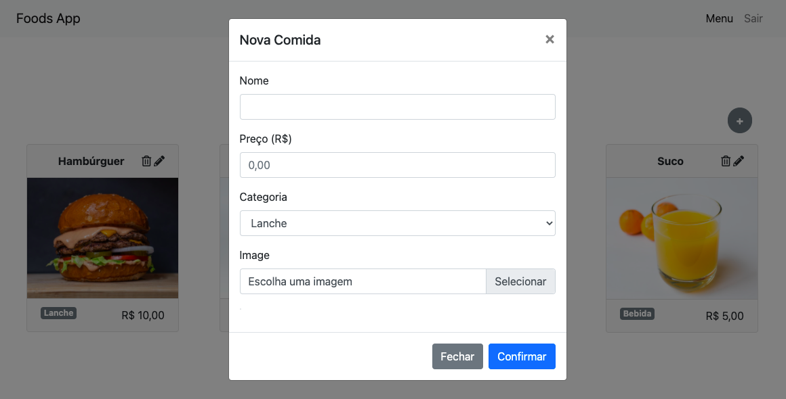
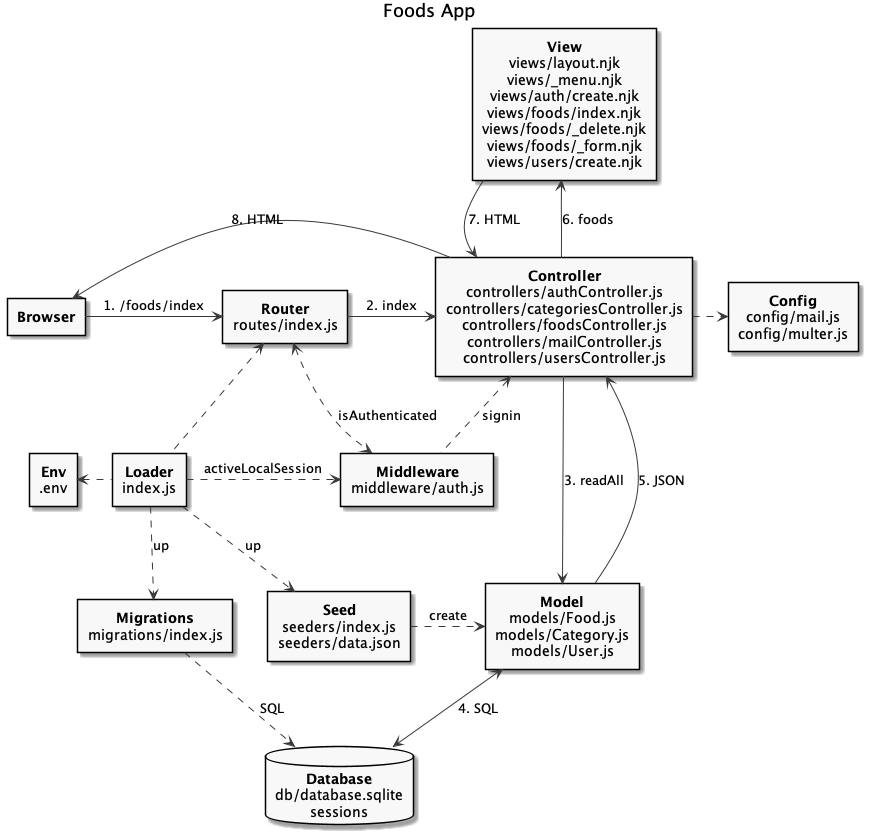

# Upload de Arquivo

- [Upload de Arquivo](#upload-de-arquivo)
  - [Foods App](#foods-app)
  - [Arquitetura do Código](#arquitetura-do-código)
  - [Load](#load)
  - [Controller](#controller)
  - [View](#view)

## Foods App

---



## Arquitetura do Código

---




```
foods-app-email
├── .env
├── .env.example
├── .gitignore
├── package-lock.json
├── package.json
├── public
│   ├── css
│   │   ├── bootstrap.min.css
│   │   └── bootstrap.min.css.map
│   ├── foods.html
│   ├── imgs
│   │   ├── batatafrita.jpg
│   │   ├── hamburguer.jpg
│   │   ├── milkshake.jpg
│   │   ├── sanduiche.jpg
│   │   └── suco.jpg
│   └── js
│       ├── bootstrap.min.js
│       ├── bootstrap.min.js.map
│       ├── jquery.min.js
│       ├── popper.min.js
│       ├── popper.min.js.map
│       └── services
│           └── api.js
├── requests.http
├── sessions
└── src
    ├── config
    │   └── mail.js
    ├── controllers
    │   ├── authController.js
    │   ├── categoriesController.js
    │   ├── foodsController.js
    │   ├── mailController.js
    │   └── usersController.js
    ├── db
    │   ├── database.sqlite
    │   ├── index.js
    │   ├── migration.js
    │   └── seed.js
    ├── index.js
    ├── middleware
    │   └── auth.js
    ├── migrations
    │   └── index.js
    ├── models
    │   ├── Category.js
    │   ├── Food.js
    │   └── User.js
    ├── routes
    │   └── index.js
    ├── seeders
    │   ├── data.json
    │   └── index.js
    └── views
        ├── _menu.njk
        ├── auth
        │   └── create.njk
        ├── foods
        │   ├── _delete.njk
        │   ├── _form.njk
        │   └── index.njk
        ├── layout.njk
        └── users
            └── create.njk
```

[](https://codesandbox.io/s/keen-sun-zo1lt?fontsize=14&hidenavigation=1&theme=dark)

## Load

---

src/config/multer.js:

```js

```

```
$ npm i multer
```

## Controller

---

src/routes/index.js:

```js
const express = require('express');
const multer = require('multer');
const router = express.Router();
...
const multerConfig = require('../config/multer');

...

router.post(
  '/foods',
  Auth.isAuthenticated,
  multer(multerConfig).single('image'),
  foodsController.create
);

...

router.put(
  '/foods/:id',
  Auth.isAuthenticated,
  multer(multerConfig).single('image'),
  foodsController.update
);
```

src/controllers/foodsController.js:

```js
...

const create = async (req, res) => {
  const { name, price, category_id } = req.body;

  const image = req.file
    ? `/imgs/${req.file.filename}`
    : '/imgs/placeholder.jpg';

  const newFood = { name, image, price, category_id };

  const foodId = await Food.createAutoInc(newFood);

  const food = await Food.readById(foodId);

  res.json(food);
};

const update = async (req, res) => {
  const { id } = req.params;

  const { name, image_path, price, category_id } = req.body;

  const image = req.file ? `/imgs/${req.file.filename}` : image_path;

  const updateFood = { name, image, price, category_id };

  await Food.update(id, updateFood);

  const food = await Food.readById(id);

  res.json(food);
};

...
```

## View

---

public/js/services/api.js:

```js
...

async function createMP(resource, data) {
  const res = await fetch(`${domain}${resource}`, {
    method: 'post',
    body: data,
  });

  return await res.json();
}

...

async function updateMP(resource, data) {
  const res = await fetch(`${domain}${resource}`, {
    method: 'put',
    body: data,
  });

  return await res.json();
}

...
```

src/views/foods/_form.njk:

```html
<div class="form-group">
  <label for="food-image-file">Image</label><br>
  <input type="hidden" id="food-image-path" name="image_path">
  <!-- <input type="file" id="food-image-file" name="image"> -->
  <div class="custom-file">
    <input type="file" class="custom-file-input" id="customFile" name="image">
    <label class="custom-file-label" for="customFile" data-browse="Selecionar">Escolha uma imagem</label>
  </div>
  
</div>
```

src/views/foods/index.njk:

```html

...

<div class="text-right">
  <button
    type="button"
    class="btn btn-secondary rounded-circle mr-4 font-weight-bold"
    id="newBtnFood"
    data-toggle="modal"
    data-target="#formFoodModal"
    onclick="loadCreateFoodForm()">
    +
  </button>
</div>

<section class="card-deck my-3">
  
  <div class="card-food col-sm-6 col-lg-4 col-xl-3 mb-3" id="food-{{ food.id }}">
    <div class="card">
      <div class="card-header text-center font-weight-bold">
        <span class="food-name">
          {{ food.name }}
        </span>
        <span class="food-actions float-right">
          <i
            class="far fa-trash-alt"
            onclick="loadDeleteFoodForm({{ food.id }}, '{{ food.name }}')"
            data-toggle="modal"
            data-target="#deleteFoodModal">
          </i>
          <i
            class="fas fa-pencil-alt"
            onclick="loadUpdateFoodForm({{ food.id }}, '{{ food.name }}', '{{ food.image }}', '{{ food.price }}', '{{ food.category }}')"
            data-toggle="modal"
            data-target="#formFoodModal">
          </i>
        </span>
      </div>
      <div class="card-body p-0">
        
      </div>
      <div class="card-footer text-right">
        <span class="food-category float-left badge badge-secondary">{{ food.category }}</span>
        <span class="food-price">{{ food.price }}</span>
      </div>
    </div>
  </div>
  
</section>





<script type="module">
  import api from '/js/services/api.js';

  const form = document.querySelector('#formFood');

  form['image'].onchange = () => {
    document.querySelector('.custom-file-label').innerText = form['image'].value;
  }

  ...

  function loadFormValues(title, foodName, foodImage, foodPrice, foodCategory) {
    const formLabel = document.querySelector('#formFoodLabel');
    const foodNameInput = document.querySelector('#food-name');
    const foodImagePreview = document.querySelector('#food-image-preview');
    const foodImagePath = document.querySelector('#food-image-path');
    const foodPriceInput = document.querySelector('#food-price');
    const foodCategorySelect = document.querySelector('#food-category');

    formLabel.innerHTML = title;
    foodNameInput.value = foodName;
    foodPriceInput.value = foodPrice;
    foodImagePreview.src = foodImage;
    foodImagePath.value = foodImage;
    Array.from(foodCategorySelect.options).forEach((option, index) => {
      if (option.innerHTML === foodCategory)
        foodCategorySelect.value = index + 1;
    })
  }

  function loadCreateFoodForm() {
    loadFormValues('Nova Comida', '', '', '', 1);

    form['image'].required = true;

    form.onsubmit = async (e) => {
      e.preventDefault();

      const food = new FormData(form);

      await api.createMP('/foods', food);

      window.location.href = '/foods/index';

      document.querySelector('#newBtnFood').blur();
    };
  }

  function loadUpdateFoodForm(...food) {
    const [id, name, image, price, category] = food;

    loadFormValues('Atualizar Comida', name, image, price, category);

    form['image'].required = false;

    form.onsubmit = async (e) => {
      e.preventDefault();

      const food = new FormData(formFood);

      await api.updateMP(`/foods/${id}`, food);

      window.location.href = '/foods/index';
    };

    document.querySelector('#food-image-preview').onchange = () => {
      document.querySelector('#food-image-preview').src = '';
    };
  }

  ...

  window.loadCreateFoodForm = loadCreateFoodForm;
  window.loadUpdateFoodForm = loadUpdateFoodForm;
  window.loadDeleteFoodForm = loadDeleteFoodForm;

  formatCurrency();
</script>


```
