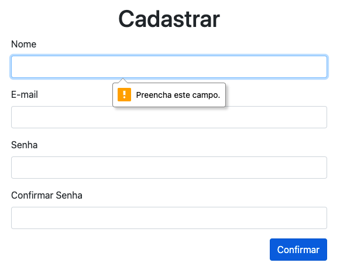
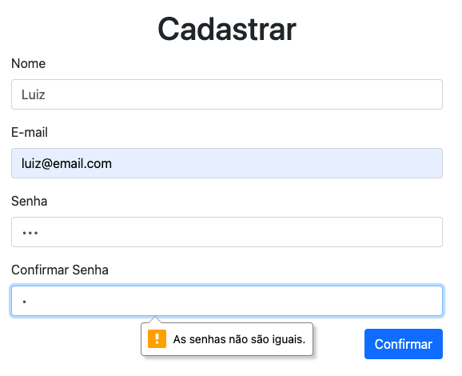
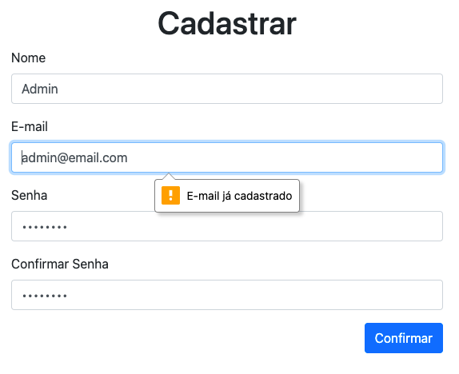
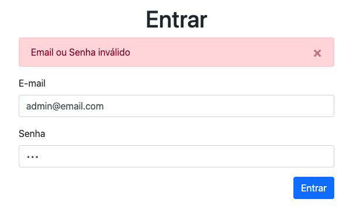

# Validação de Dados

  - [Foods App](#foods-app)
  - [Nome Obrigatório](#nome-obrigatório)
  - [Confirmação da Senha](#confirmação-da-senha)
  - [Email Único](#email-único)
  - [Erro no Login](#erro-no-login)

## Foods App

---


```
foods-app-validation
├── .env
├── .env.example
├── .gitignore
├── package-lock.json
├── package.json
├── public
│   ├── css
│   │   ├── bootstrap.min.css
│   │   └── bootstrap.min.css.map
│   ├── foods.html
│   ├── imgs
│   │   ├── batatafrita.jpg
│   │   ├── hamburguer.jpg
│   │   ├── milkshake.jpg
│   │   ├── placeholder.jpg
│   │   ├── sanduiche.jpg
│   │   └── suco.jpg
│   └── js
│       ├── bootstrap.min.js
│       ├── bootstrap.min.js.map
│       ├── jquery.min.js
│       ├── popper.min.js
│       ├── popper.min.js.map
│       └── services
│           └── api.js
├── requests.http
├── sessions
└── src
    ├── config
    │   ├── mail.js
    │   └── multer.js
    ├── controllers
    │   ├── authController.js
    │   ├── categoriesController.js
    │   ├── foodsController.js
    │   ├── mailController.js
    │   └── usersController.js
    ├── db
    │   ├── database.sqlite
    │   ├── index.js
    │   ├── migration.js
    │   └── seed.js
    ├── index.js
    ├── middleware
    │   └── auth.js
    ├── migrations
    │   └── index.js
    ├── models
    │   ├── Category.js
    │   ├── Food.js
    │   └── User.js
    ├── routes
    │   └── index.js
    ├── seeders
    │   ├── data.json
    │   └── index.js
    └── views
        ├── _menu.njk
        ├── auth
        │   └── create.njk
        ├── foods
        │   ├── _delete.njk
        │   ├── _form.njk
        │   └── index.njk
        ├── layout.njk
        └── users
            └── create.njk
```

[](https://codesandbox.io/s/vigorous-easley-z528n?fontsize=14&hidenavigation=1&theme=dark)


## Nome Obrigatório

---



src/views/foods/_form.njk:

```html

<form id="formFood" enctype="multipart/form-data">
  <div class="modal fade" id="formFoodModal" tabindex="-1" aria-labelledby="formFoodLabel" aria-hidden="true">
    <div class="modal-dialog">
      <div class="modal-content">
        <div class="modal-header">
          <h5 class="modal-title" id="formFoodLabel"></h5>
          <button type="button" class="close" data-dismiss="modal" aria-label="Close">
            <span aria-hidden="true">&times;</span>
          </button>
        </div>
        <div class="modal-body">
          <div class="form-group">
            <label for="food-name">Nome</label>
            <input type="text" class="form-control" id="food-name" name="name" required>
          </div>
          <div class="form-group">
            <label for="food-price">Preço (R$)</label>
            <input type="number" class="form-control" id="food-price" name="price" step="0.01" placeholder="0,00" required>
          </div>
          <div class="form-group">
            <label for="food-category">Categoria</label>
            <select class="form-control" id="food-category" name="category_id">
              
                <option value="{{ category.id }}">{{ category.name }}</option>
              
            </select>
          </div>
          <div class="form-group">
            <label for="food-image-file">Image</label><br>
            <input type="hidden" id="food-image-path" name="image_path">
            <div class="custom-file">
              <input type="file" class="custom-file-input" id="food-image-file" name="image">
              <label class="custom-file-label" for="food-image-file" data-browse="Selecionar">Escolha uma imagem</label>
            </div>
            
          </div>
        </div>
        <div class="modal-footer">
          <button type="button" class="btn btn-secondary" data-dismiss="modal">Fechar</button>
          <button type="submit" class="btn btn-primary">Confirmar</button>
        </div>
      </div>
    </div>
  </div>
</form>

```

## Confirmação da Senha

---



src/views/users/create.njk:

```html

...
<div class="row">
  <div class="col-md-6 mx-auto mb-5">
    <form id="formUser" action="/signup" method="post">
      <div class="form-group">
        <label for="user-name">Nome</label>
        <input type="text" class="form-control" id="user-name" name="name" value="{{ newUser.name }}" required>
      </div>
      <div class="form-group">
        <label for="user-email">E-mail</label>
        <input type="email" class="form-control" id="user-email" name="email" value="{{ newUser.email }}" required>
      </div>
      <div class="form-group">
        <label for="user-password">Senha</label>
        <input type="password" class="form-control" id="user-password" name="password" value="{{ newUser.password }}" minlength="8" required>
      </div>
      <div class="form-group">
        <label for="user-confirm_password">Confirmar Senha</label>
        <input type="password" class="form-control" id="user-confirm_password" name="confirm_password" value="{{ newUser.password }}" required>
      </div>
      <div class="form-group">
        <button type="submit" class="btn btn-primary float-right">Confirmar</button>
      </div>
    </form>

  </div>
</div>



<script>
const form = document.querySelector('#formUser');

...

form['confirm_password'].oninput = (e) => {
  const password = form['password'].value;
  const confirm_password = form['confirm_password'].value;

  if (password !== confirm_password) {
    form['confirm_password'].setCustomValidity('As senhas não são iguais.');
    form['confirm_password'].reportValidity();
  } else {
    form['confirm_password'].setCustomValidity('');
    form['confirm_password'].reportValidity();
  }
};
</script>

```

## Email Único

---



src/views/users/create.njk:

```html

...
<div class="row">
  <div class="col-md-6 mx-auto mb-5">
    <form id="formUser" action="/signup" method="post">
      <div class="form-group">
        <label for="user-name">Nome</label>
        <input type="text" class="form-control" id="user-name" name="name" value="{{ newUser.name }}" required>
      </div>
      <div class="form-group">
        <label for="user-email">E-mail</label>
        <input type="email" class="form-control" id="user-email" name="email" value="{{ newUser.email }}" required>
      </div>
      <div class="form-group">
        <label for="user-password">Senha</label>
        <input type="password" class="form-control" id="user-password" name="password" value="{{ newUser.password }}" minlength="8" required>
      </div>
      <div class="form-group">
        <label for="user-confirm_password">Confirmar Senha</label>
        <input type="password" class="form-control" id="user-confirm_password" name="confirm_password" value="{{ newUser.password }}" required>
      </div>
      <div class="form-group">
        <button type="submit" class="btn btn-primary float-right">Confirmar</button>
      </div>
    </form>

  </div>
</div>



<script>
const form = document.querySelector('#formUser');


  form['email'].setCustomValidity('{{ error }}');
  form['email'].reportValidity();


form['email'].oninput = (e) => {
  form['email'].setCustomValidity('');
  form['email'].reportValidity();
};

...
</script>

```

src/controllers/usersController.js:

```js:
const store = async (req, res) => {
  const { name, email, password } = req.body;

  const newUser = { name, email, password };

  try {
    await User.createAutoInc(newUser);

    await mailController.sendCreateUser(email);

    res.redirect('/signin');
  } catch (err) {
    if (String(err).includes('UNIQUE constraint failed')) {
      res.render('users/create.njk', {
        error: 'E-mail já cadastrado',
        newUser,
      });
    }
  }
};
```

## Erro no Login

---



src/views/users/create.njk:

```html

...
<div class="row">
  <div class="col-md-6 mx-auto">
    
      <div class="alert alert-danger alert-dismissible fade show" role="alert">
        {{ error }}
        <button type="button" class="close" data-dismiss="alert" aria-label="Close">
          <span aria-hidden="true">&times;</span>
        </button>
      </div>
    
    <form id="formUser" action="/signin" method="post">
      <div class="form-group">
        <label for="user-email">E-mail</label>
        <input type="email" class="form-control" id="user-email" name="email" value="{{ login.email }}" required>
      </div>
      <div class="form-group">
        <label for="user-password">Senha</label>
        <input type="password" class="form-control" id="user-password" name="password" value="{{ login.password }}" required>
      </div>
      <div class="form-group">
        <button type="submit" class="btn btn-primary float-right">Entrar</button>
      </div>
    </form>
  </div>
</div>


```

src/controllers/authController.js:

```js
async function signin(req, res) {
  const { email, password } = req.body;

  const user = await User.readByEmail(email);

  const match = user
    ? await bcrypt.compare(password, user.password)
    : undefined;

  if (user && match) {
    req.session.isAuth = true;
    req.session.userId = user.id;
    res.redirect('/');
  } else {
    res.render('auth/create.njk', {
      error: 'Email ou Senha inválido',
      login: { email, password },
    });
  }
}
```
